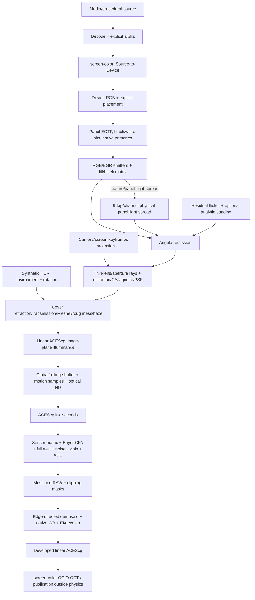
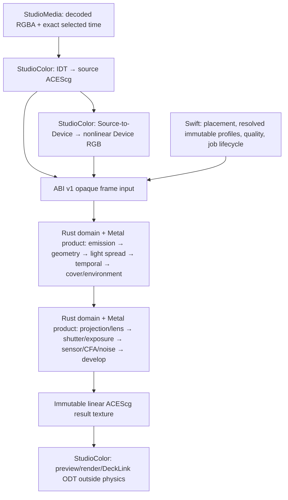

# Auditoría de paridad física: Rust/Slint anterior → motor nativo

Estado: inventario de migración, no contrato normativo.

Fecha de evidencia: 2026-08-06.

## 1. Alcance, autoridades y método

Esta auditoría compara código, shaders, tests, benchmarks y documentación activa de cuatro autoridades Git. No se ha usado `Docs/old`, no se ha cambiado código de producto y no se presupone que todos los modelos antiguos vivieran en un único `HEAD`.

| Autoridad | Commit fijado | Uso en esta auditoría |
|---|---|---|
| Rust/Slint anterior | `main@715ec98f0acbe1d9855b66121e5aab111c5c452e` | Último estado integrado del producto Slint y del pipeline óptico/cámara completo. |
| Light spread del panel | `feature/panel-light-spread@0121aa53a17ff63b8ae435bd94248de80b553d2a` | Autoridad posterior separada: implementación `b58525cec55d006879b5fb5e9f47399148378130` y contrato/documentación `0121aa5`. |
| Motor plano actual | `feature/physical-panel-spatial-v1@04dbfb2a1e433d271cf8fc533c94597986f85307` | Oracle CPU, Metal y bridge ABI v1 para emisión y geometría píxel/subpíxel. |
| Shell nativo consumidor | `feature/native-macos-shell@0742a42199fc15e609b627ae01e2a8c2a81abb9e` | UI y orquestación realmente conectadas al job físico Metal. |

Los últimos commits por archivo no bastan para atribuir cada modelo. La matriz cita además el último cambio semántico relevante cuando difiere del `HEAD`: `93f10a1` (conexión espacial Metal), `a803fa9` (integración de área UHD estable), `18b8448` (flicker residual uniforme), `9d54b3f` (entornos HDR), `7ab435c` (cierre de auditoría óptica), `980cd3e` (softness en espacio sensor), `5e09962` (demosaic edge-directed), `0ac32e0` (RAW development Metal) y `b58525c` (light spread).

Validación ejecutada durante la auditoría:

- `main`: `cargo test --workspace -q`, 161 tests con resultado positivo.
- `feature/panel-light-spread`: `cargo test -p screen-panel -p screen-application -p screen-platform -q`, 88 tests con resultado positivo.
- Los benchmarks citados son mediciones registradas en el repositorio; las proyecciones antiguas a 48 MP se etiquetan como proyecciones y no como mediciones.

## 2. Conclusiones ejecutivas

1. El pipeline Rust/Slint anterior no era un prototipo vacío. Cámara, lente, cover, entorno, shutter, sensor, ruido, RAW y desarrollo estaban implementados, conectados y probados; Metal era obligatorio en spatial optics, RAW development y publicación Native.
2. Ese código sigue físicamente presente en los crates de la rama del motor plano porque ésta parte de `main@715ec98`; la regresión actual es principalmente de **alcanzabilidad por el ABI y el shell nativo**, no de pérdida de fuentes.
3. Emisión y geometría subpíxel sí están migradas al job nativo, con un nuevo backend plano especializado. Conservan el catálogo y `ValidatedPanelEvaluator`, pero todavía no consumen geometría cámara–pantalla, respuesta angular, cover ni captura.
4. El bloom de píxeles, denominado autoritativamente **panel light spread**, quedó **implementado y conectado**, no parcial ni solamente documentado. Vive fuera de `main`, en `b58525c`, y dispone de CPU, Metal, UI Slint, persistencia schema 8, tests y benchmark.
5. El ABI v1 actual no transporta `PanelLightSpreadProfile`. Tampoco pasa un `ScreenCoverGlassProfileRef` al frame job, no define un perfil de entorno y no lleva cámara/lente/sensor. Activar esas tarjetas de UI sin resolver primero el transporte sería inventar defaults o duplicar física en Swift.
6. `ScreenDeviceParametersV1` ya transporta el perfil temporal completo. Flicker/banding es el corte pendiente que menos frontera nueva necesita, pero depende de definir su relación exacta con exposición/captura para no crear banding espacial falso.
7. Hay tres superficies nativas anteriores que ya no forman parte de la ruta de producto: `DeviceMetalStage.swift`, `Resources/DeviceStage.metal` y `PhysicalPipeline.swift`/`screen_physical_pipeline_process_rgba32f`. No deben convertirse en fallback ni recibir nuevos modelos.

## A. Pipeline anterior real

El diagrama incluye el light spread únicamente donde existía en su rama autoritativa; todo lo demás corresponde a la ruta conectada de `main`.

Orden real relevante:

- Placement y señal se resuelven antes de la EOTF.
- Light spread opera sobre emisión post-EOTF en primarias nativas, antes de cover y lente, y no modula el entorno.
- El muestreo de lente/cámara determina qué emisores y qué footprint contribuyen; conversión de primarias nativas a ACEScg ocurre después de la evaluación por canal.
- Flicker/banding multiplica solo emisión, nunca reflexión de entorno.
- ND y shutter convierten iluminancia a lux-seconds antes de fotositos.
- CFA es discreto; demosaic y white balance ocurren después de RAW.
- ODT/view nunca pertenece al motor físico.

## B. Pipeline nativo objetivo y autoridad de fronteras

Autoridad por frontera:

- StudioMedia: decodificación, orientación, alpha declarado y selección temporal exacta.
- StudioColor: IDT, Source-to-Device y todos los ODT/view.
- Rust `screen-panel`, `screen-cover`, `screen-geometry`, `screen-sensor`, `screen-camera`: significado y validación física.
- `screen-application`: request inmutable, orden, integración temporal y coordinación.
- `screen-platform`: ejecución Metal obligatoria; CPU solo oracle.
- Swift: edición/orquestación, resolución explícita de snapshots, estado stale/progreso/cancelación y presentación. No fórmulas físicas.

## C. Matriz completa old → new

Abreviaturas de estado actual: **M** migrado y conectado por el job; **P** parcial (tipos/datos/UI o código conservado, pero no evaluación ABI completa); **N** pendiente/inaccesible; **X** deliberadamente fuera del motor físico.

| 1. Modelo / etapa | 2. Propósito visual | 3. Autoridad antigua (archivo, símbolo, shader, commit) | 4. Estado antiguo demostrado | 5. Tests / benchmark antiguos | 6. Dominio E/S | 7. Parámetros, presets y unidades | 8. Dependencias y orden | 9. Nativo actual | 10. Reutilización | 11. Precisión / rendimiento esperados | 12. UI actual y faltantes | 13. Pruebas para paridad |
|---|---|---|---|---|---|---|---|---|---|---|---|---|
| Source decode y alpha | Entregar RGB y alpha inequívocos. | `screen-media`; `decoded_frame_to_device_signal`; `715ec98`. | Implementado y conectado. | Tests de alpha straight/premultiplied/ignore, EXR y codecs. | Encoded/decoded RGB → buffer interpretado; luego ACEScg/Device. | Matrix, range, IDT y asociación alpha explícitos. | Antes de StudioColor y física. | **M/X**: MediaDecoder+StudioMedia; alpha/IDT fuera del motor. | Mantener frontera nativa; no portar decodificador Rust como ruta paralela. | Sin pérdida si coinciden vectores de color/alpha. | Native tiene interpretación de entrada; faltan diagnósticos físicos de alpha, no otro control. | Golden RGBA, negativos, >1, alpha 0/straight/premultiplied y tiempos exactos. |
| Source ACEScg + Source-to-Device | Separar identidad lineal y señal no lineal que excita el panel. | `screen-color::SourceToDeviceProcessor`, `decoded_frame_to_device_signal`; integración `2f7e007`, contrato `3c2807c`. | Implementado/conectado en ambos shells. | Paridad StudioColor/OCIO y tests Device nativos. | Source ACEScg → Device RGB; conserva también Source ACEScg. | Transform IDs OCIO; RGBA float. | Antes de placement/EOTF. | **M**: las dos texturas cruzan `PhysicalFrameInput`. | Reusar StudioColor; retirar cualquier transformación duplicada Rust/Swift. | Solo tolerancia OCIO declarada; no cuantizar. | Native lo representa implícitamente; sería útil diagnóstico de ambas texturas, no selector nuevo. | Vectores OCIO, negativos/>1, alpha, ownership y lifetime de ambas texturas. |
| Raster placement | Fit, Fill/Crop, Stretch y 1:1 centrado sin cambiar color. | `RasterPlacement`, `source_uv_for_device_uv`, summed-area sampling; `93f10a1`, arreglo UHD `a803fa9`. | Implementado y conectado CPU/Metal/Slint. | `raster_placement_is_explicit_and_deterministic`, todas las mappings y paridad Metal. | Device RGB raster → Device RGB en dominio panel. | Dos rasters en px; enum discreto. | Tras Source-to-Device, antes de EOTF espacial. | **M** en ABI y UI nativa. | Ya reutilizado; mantener una sola función/semántica. | Flat backend integra área; no se espera pérdida. | Picker Placement actual completo. | Encuadre idéntico en cuatro calidades, bordes Fit, crop Fill, 1:1 impar/par y CPU/Metal. |
| EOTF, negro y luminancia | Convertir código a emisión física absoluta y contraste. | `LcdProfile`, `ValidatedPanelEvaluator::native_channel`, `emitted_radiance`; `screen-panel`, último plan `93f10a1`. | Implementado/conectado. | EOTF >1/negativos, escala fotométrica y ratio de medio código. | Device RGB → radiancia/luminancia nativa → ACEScg. | gamma; black/white `nit`; 9 devices. | Después de placement; antes de geometría/spread. | **M** flat CPU/Metal/ABI. | Reuso directo ya realizado. | Flat conserva float; current Metal máx abs `2.861023e-6` RGBA32. | Editor Device y tarjeta Emisión; amount conectado. | Escala 9 parches, negro no cero, negativos/>1, amount 0/1/>1, alpha. |
| Primarias, blanco y adaptación | Reproducir color nativo y adaptar al blanco ACEScg D60. | `PanelColorimetry`, `native_to_acescg_matrix`, Bradford; `b589846`, `93f10a1`. | Implementado/conectado. | Golden sRGB-D65→ACEScg y matrices degeneradas. | Radiancia en primarias panel → ACEScg. | xy primarias/blanco, matriz 3×3. | Tras contribuciones ópticas por canal. | **M** en flat; parámetros derivados cruzan Device handle. | Reuso directo del evaluator. | Misma matemática CPU; Metal usa matriz resuelta. | Editor de cromaticidad completo; falta exponer base/diagnóstico de matriz en Modelo. | White neutral, primarias golden, matrices límite, CPU/Metal. |
| Respuesta angular del panel | Caída y separación cromática al observar oblicuo. | `angular_emission_power`, `angular_channel`; shader `spatial_optics.metal`; `35fa9ac`. | Implementado/conectado en cámara anterior. | Rear-face zero, CPU/Metal oblicuo y full-resolution phase. | Emisión nativa + coseno → iluminancia por canal. | Potencia RGB adimensional. | Después de EOTF/geometría, durante ray integration. | **P/N**: perfil cruza ABI y se edita, pero superficie plana siempre normal y no lo evalúa. | Conectar directamente al futuro corte Geometry/Lens; no aproximar en flat. | Riesgo alto de fase a ángulos extremos; safe math obligatoria. | Device editor presente; tarjeta Emisión no indica que angular está pendiente. | Barrido angular/canal, cara trasera exacta, CPU/Metal y energía. |
| Geometría píxel/subpíxel | RGB/BGR, fill factor y matriz negra físicamente resolubles. | `StripeLayout`, `native_channel_at_pixel`, `native_channel_over_device_rect`; `eae15ed`, `35fa9ac`. | Implementado/conectado. | RGB/BGR, matriz negra, integración resolved/unresolved, fase full sensor. | Emisión nativa continua → emisión espacial. | raster px, active m, matrix fraction, layout discreto. | Tras EOTF; antes de spread/cover. | **M** mediante nueva retícula Native `3×3` por píxel. | Reuso directo de perfil/evaluator; nuevo kernel plano es autoridad de producto actual. | Native aumenta memoria; ASUS UHD medido ~1.46 GB. | Editor/preset y tarjeta conectados; diagnóstico resolved disponible. | RGB/BGR, matrix extrema, pitch x/y, energía, calidad convergente y fase no-origin. |
| Panel light spread / pixel bloom | Difundir lateralmente luz emitida entre celdas sin crear energía. | `PanelLightSpreadProfile`, `samples_for_channel`, `spread_*_native_channel`; shader `light_spread_sample`; `b58525c`, docs `0121aa5`. | **Implementado y conectado** CPU+Metal+Slint+persistence; no está en `main`. | 88 tests focalizados pasan; energía, identidad, escala física, determinismo, CPU/Metal. Benchmark: stripe 0.044 s medido; ROI 0.094/0.363 s; 48 MP 2.6/10.0 s son proyecciones. | Emisión post-EOTF en primarias nativas → emisión nativa difundida. | strength 0–3; core/tail radius RGB `µm`; weights RGB; LCD mobile/desktop/TV y perfiles contenidos OLED/micro-LED. | Después de geometría/emisión; antes de cover/lens; no altera environment. | **N, regresión P0**. Código no está en rama física; ABI Device v1 no lleva el perfil. | Extraer `b58525c`: cherry-pick completo no es apropiado por divergencia; portar dominio/muestras y adaptar al flat oracle+Metal solo tras decisión contractual de transporte. | 9 taps/canal normalizados; coste medido pequeño en stripe, mayor con 8 muestras. Bordes permiten pérdida fuera del panel finito. | Native no tiene campo/perfil ni tarjeta propia; Emisión/Subpixel no deben absorberlo silenciosamente. | Bit exact amount 0, suma 1/canal, impulse/edge, radios invariantes al raster, presets distintos, CPU/Metal 0/1/>1, benchmark Flat Native. |
| Flicker residual | Modulación leve de luminancia durante exposición sin bandas falsas. | `PanelTemporalEmission`, `ResidualFlicker`, `average_gain`; `31ec9e6`, corrección `18b8448`. | Implementado/conectado y analíticamente integrable. | `residual_flicker_stays_frame_uniform...`, ciclos completos y rolling. | Radiancia emitida + tiempo racional → gain medio. | periodo/fase racional, amplitud; defaults 240 Hz/0.2%. | Multiplica solo emisión; se integra por intervalo shutter. | **P/N**: parámetros ya en ABI/Device/UI, job rechaza Temporal activo. | Adaptación directa de dominio; compartir `average_gain`; requiere tiempo/exposure explícito en request. | Analítico, coste despreciable; preservar f64/racionales hasta frontera. | Device editor muestra Hz/amplitud; tarjeta Temporal deshabilitada. | Uniformidad global con rolling, media exacta 1, fase negativa, cantidad 0/1/>1 si se autoriza. |
| Banding creativo duty-cycle | Crear bandas controladas por interacción panel/rolling shutter sin alterar luminancia media. | `AnalyticBanding`, `banding_transitions_between`, `rolling_temporal_gain`; `31ec9e6`, `3dc7971`. | Implementado/conectado; separado de flicker. | amount 0 exacto, ganancia media, rolling phase, 8 samples y RAW exacto. | Radiancia emitida + row time → gain. | periodo/on-duration/fase racional; amount 0–1; UI Hz/duty. | Tras scheduling rolling; nunca sobre environment. | **P/N**: datos cruzan Device, no ejecución. | Reusar scheduling/Application; no convertir en post efecto 2D. | Analítico; evita subdivisión PWM costosa. | Device editor permite Hz/amount pero no duty/phase completos en shell nativo; tarjeta bloqueada. | Global vs rolling, dos direcciones, duties límite, media, amount 0 exacto, no modulación de reflection. |
| Refresh mismatch / persistencia / scanout de panel | Retención, sample-and-hold y desajuste de cadencias reales. | No hay tipo, función ni shader. `camera_time_and_space.md` solo separa project/source/panel refresh; `sensor_capture.md` excluye scanout/sample-and-hold. | No implementado; límite documentado. | Ninguno. | Requeriría señal temporal de panel, no imagen post. | Refresh racional, hold/decay, scan direction por definir. | Antes/durante shutter; dependiente de source cadence. | **N**. | Diseño nuevo futuro; no reutilizar analytic banding como sustituto. | Desconocidos; probable crecimiento de muestras/caché. | Tarjeta Temporal menciona persistencia, pero no hay controles ni modelo; debe marcarse futuro explícito. | Impulsos temporales, cadencias no conmensurables, energía, rolling interaction, determinismo. |
| Cover: transmisión y absorción | Reducir/tintar emisión según espesor y ángulo. | `CoverGlassProfile`, `ValidatedCoverEvaluator::transmission`; `e36b46f`, `35fa9ac`. | Implementado/conectado CPU+Metal. | zero exact, absorption, thick cover, CPU/Metal. | Emisión/illuminance → transmitida. | strength 0–2, thickness mm, IOR, absorption RGB/mm, haze. | Después de panel/spread, antes de sensor. | **P/N**: catálogo/CRUD y opaque handle existen; frame request no recibe cover. | Reusar crate y shader; añadir transporte resuelto antes de activar. | Exp/angle float; antigua tolerancia spatial abs `2e-3` o rel `2e-4`. | Library Cover completa; tarjeta Cristal bloqueada y solo muestra preset asociado. | Identidad 0, Beer-Lambert, ángulos, espesor, negativos/>1 en emisión, CPU/Metal. |
| Cover: Fresnel, IOR y AR | Reflejo de interfaz y negros/contraste a incidencia oblicua. | `interface`, `reflected_illuminance`; `e36b46f`, `9d54b3f`. | Implementado/conectado. | grazing growth; IOR=1 y AR=1 reflexión exacta cero. | Environment radiance + view ray → illuminance reflejada. | IOR 1–2.5, AR 0–1, strength. | Une environment con cover; no modulado por panel temporal. | **P/N** por falta de perfil en job. | Extracción directa; no recrear Fresnel en Swift. | Riesgo de error cerca de grazing; tests exactos de casos cero. | CRUD editable; etapa deshabilitada. | Normal/grazing, IOR/AR identidades, energía y CPU/Metal. |
| Cover: roughness, haze y refracción lateral | Suavizar reflejos y desplazar la muestra transmitida por slab. | `environment_radiance`, `transmitted_lateral_offset_meters`; `9d54b3f`, fase `35fa9ac`. | Aproximación física implementada/conectada. | Grid pierde contraste; thick cover refracts; parity por rotación. | Ray/environment/emission → muestra desplazada y reflexión redistribuida. | roughness/haze 0–1; thickness mm. | Antes de evaluación final por canal/aperture. | **P/N**. | Reusar exactamente; no sustituir por blur de pantalla. | Sampling analítico bounded; fase sensible. | Campos en biblioteca; sin controles de etapa en Modelo. | Grid/softbox, energy bound, displacement sign/magnitude, resolved subpixels, CPU/Metal. |
| Entorno HDR sintético, reflejos y rotación | Reflejos estructurados, color y contraste aparente. | `ProceduralEnvironment`, `EnvironmentPattern`, `ENVIRONMENT_PRESETS`, shader spatial; `9d54b3f`, `0d3e849`. | Implementado/conectado CPU+Metal/Slint. | Todos los patterns + rotación 37°, grid roughness y parity. | ACEScg radiance → reflected image-plane illuminance. | ambient/key RGB radiance 0–100000, direction, angular radius degrees, rotation ±180°, strength 0–4; uniform/softboxes/grid. | Solo entra por cover Fresnel; se suma después de transmisión. | **N**: shell declara explícitamente que no hay perfil conectado; ABI no tiene environment. | Reusar `screen-cover`; diseñar snapshot/handle único. | Analítico rápido; una futura HDRI reemplaza sampler, no crea ruta. | No hay library/editor de environment actual. | Cero exacto, rotación, cada pattern, no temporal modulation, CPU/Metal. |
| Iluminación del entorno/chasis por el panel | Spill físico sobre objetos o bordes externos. | Solo contrato futuro en `color_and_panel.md` de rama spread: area emitter; no código. | Solo documentación. El spread puede perder energía fuera del active panel, pero no ilumina geometría externa. | Ninguno. | Panel radiance → scene geometry radiance. | Geometría/materiales de escena aún inexistentes. | Después de panel; responsabilidad de futuro scene renderer. | **N/futuro**. | No reutilizar halo/edge glow 2D. Consumir panel ya evaluado como area emitter. | Coste de light transport no determinado. | Sin UI. | Conservación energética, falloff/occlusion, bordes, comparación con halo prohibido. |
| Geometría cámara–pantalla | Perspectiva, escala física, yaw/pitch/distancia y encuadre. | `CameraRig`, `ScreenTrack`, `project_screen`, `panel_uv_*`; `screen-geometry`; `7ab435c`, fase Metal `35fa9ac`. | Implementado/conectado CPU+Metal/Slint. | Roundtrip, matrices canónicas, transformed screen, phase full-resolution. | Coordenadas mundo m + gate/lens mm → rays/UV/illuminance. | translation m, quaternion, focal/gate mm, lens shift, near/far m. | Prepara rays que muestrean panel/cover/lens. | **P/N**: crate sigue presente; Capture.Geometry ABI no lleva tracks/intrinsics y está bloqueado. | Conectar tipos existentes mediante request resuelto; no rehacer en Swift. | Fase subpíxel extremadamente sensible; safe math/no contraction. | Native solo muestra tarjeta pendiente; faltan distance/yaw/pitch/focal/gate/screen transform. | Matrices/roundtrip, yaw/pitch extremos, clipping, aspect, CPU/Metal no-origin. |
| Cámara de inspección física | Reencuadrar una región del panel para resolver subpíxeles sin confundir zoom de visor. | `PanelRegion`, `fit_panel_region`, `inspection_region_from_drag`; `7e8ee5b`, UI desde `81c9d92`. | Implementado/conectado en Slint. | Región física, drag roundtrip y oblique inspection. | Drag NDC → region UV → camera sample físico. | region UV, distance m. | Variante explícita de geometry, misma óptica. | **N**. | Reusar después de Geometry; mantenerlo separado de zoom 1:1. | Misma precisión de ray tracing. | Native solo tiene Fit/1:1 de visor, no inspección física. | Drag/inverse map, oblique, framing exacto, no mutar camera authored. |
| Thin lens, foco y profundidad de campo | Desenfoque físico dependiente de foco, distancia y apertura. | `panel_uv_aperture_samples*`, `aperture_disk_samples`; `4559a6f`, `7ab435c`. | Implementado/conectado. | Convergencia a plano de foco, nested 16/32/64/128, seams y clipping. | Camera ray → múltiples panel samples/weights. | focus m, focal mm, f-stop; 16–128 samples. | Dentro de geometry/lens antes de cover integration. | **P/N**. | Reuso directo del sampler y plan; backend Metal antiguo ya existe. | Coste escala con aperture samples; no reducir según calidad semántica. | Sin controles nativos de foco/f-stop. | Focus plane, CoC, nested determinism, quality invariance, CPU/Metal. |
| Distorsión radial/tangencial | Barrel/pincushion y descentramiento. | `LensModel`, `distort`, `inverse_distortion`; presets; `d6797cd`, `7ab435c`. | Aproximación implementada/conectada. | Inverse roundtrip, folding rejection, catalog certification. | Ideal sensor coordinate → distorted ray. | k1–k3, p1–p2 adimensionales. | Antes de ray-plane intersection. | **P/N**. | Reusar crate y shader; materializar preset completo. | Iteración inversa y phase sensitivity; no interpolar modelos inválidos. | Sin library/selector lente nativo. | Full-gate invertibility, midpoint interpolation, extreme reject, parity. |
| Aberración cromática longitudinal/lateral | Fringes ópticos y foco/escala distintos por canal. | `longitudinal_chromatic_meters`, `lateral_chromatic_scale`, `panel_uv_for_lens_sample`; `d4d440a`, `7ab435c`. | Aproximación implementada/conectada. | `rgb_lens_model_separates_channels...`, lens catalog. | Ray ideal → tres UV/weights. | offsets m RGB, scale RGB. | Antes de panel sample por canal. | **P/N**. | Reuso directo; conservar topología por canal. | Requiere tres intersecciones; tolerancia spatial existente. | Sin controles. | Primarias/edges, sign, focus variation, CPU/Metal, zero ideal. |
| Viñeta y transmisión de lente | Caída periférica y tinte/throughput. | `vignetting_strength`, `transmission_rgb`, `lens_irradiance_weight`; `d4d440a`, `7ab435c`. | Aproximación implementada/conectada. | Edge attenuation y f-number throughput. | Radiancia por ray → illuminance RGB. | strength, transmission RGB, f-stop. | Durante integración de lente, antes de shutter. | **P/N**. | Reuso directo. | Operación barata; conservar luminancia absoluta. | Sin controles. | Centro/borde, f-stop ratios, amount 0/1/>1, CPU/Metal. |
| PSF/MTF y difracción aproximada | Softness de lente/sensor, Airy verde y detalle fino. | `approximate_psf_radius_pixels`, `center/edge_softness_micrometers`; shader footprint; `980cd3e`, `7ab435c`. | Aproximación implementada/conectada. | Escala con f-number/densidad/campo, sin cap, aplica al resolved sampling. | Panel optical footprint → sensor-plane blur. | softness µm, λ verde fija 0.550 µm, f-stop, photosite pitch. | Convolución de footprint dentro de lens, distinta de panel spread. | **P/N**. | Reusar; no fusionar con light spread, cover haze o sensor bloom. | Más muestras cuando resolved; no blur 2D post. | Sin controles ni MTF diagnostic nativo. | Impulse/Siemens/slanted edge, scaling físico, zero lens amount, CPU/Metal. |
| Exposición, EI/ISO, shutter angle y optical ND | Escala fotométrica y control de captura. | `FrameCaptureRequest`, `finish_integrated_exposure`, `CameraDevelopment`; `a0f7f11`, `7ab435c`. | Implementado/conectado. | ND exacto, middle gray, preview/native photometry. | Illuminance → lux-seconds → developed ACEScg. | EI, shutter angle 1–360°, ND 0–16 stops, middle-gray lux·s, develop EV. | Shutter/ND antes de sensor; EI/develop después de RAW. | **P/N**: contribución existe pero no parámetros ABI/UI. | Reusar Application/Camera; evitar slider RGB genérico. | f64 accumulation; no clipping antes del sensor. | Capture card bloqueada; faltan todos los controles. | Ratios stops/shutter, EI reference, negatives, Native vs ideal preview. |
| Global shutter y motion integration | Integrar fuente y movimiento durante exposición. | `SensorReadout::Global`, `shutter_quadrature`, sequence capture; `14c106a`, optimizaciones `6caffb5`. | Implementado/conectado. Motion blur surge de samples, no post blur. | Exact centered quadrature, animated source/camera, thread determinism. | Optical ACEScg(t) → ACEScg lux-seconds. | duration racional, 1–64 motion samples. | Después de spatial optics por tiempo; antes de sensor. | **P/N**. | Reusar scheduling/plan batching; adaptar a job cancellation/progress. | Coste por planes únicos; static reuse probado. | Sin selector global/muestras. | Exact times/weights, animated media/tracks, static reuse equality, cancellation. |
| Rolling shutter/readout | Offset de tiempo por fila y skew/banding físico. | `SensorReadout::Rolling`, `rolling_row_center_time`, row batching; `14c106a`, `3dc7971`, `0977ebc`. | Implementado/conectado. | Direcciones, full-vs-region crop, 8 samples, row template, RAW exacto. | Optical sequence → row-wise lux-seconds. | readout racional, top→bottom/bottom→top. | Coordina temporal panel, motion y sensor rows. | **P/N**. | Reusar íntegro; mapear progreso a tiles/stripes del nuevo job. | Antigua optimización de stripes real; preservar suma ordenada. | Sin controles. | Dos direcciones, global equivalence at zero readout decision, crop phase, motion/banding. |
| Sensor físico, resolución y CFA | Muestreo de fotositos y mosaico Bayer con fase global. | `SensorProfile`, `BayerPattern`, `SensorRegion`; `ea49074`, `9bcdaad`. | Implementado/conectado. | Cuatro CFA, crop/full identity, region halo, presets ALEXA/iPhone. | ACEScg lux-seconds → mosaiced native RAW. | native px, gate mm en capture preset; RGGB/BGGR/GRBG/GBRG; 3×3 ACEScg→sensor. | Tras shutter; antes de noise/ADC y demosaic. | **P/N**: enums ABI existen, sin perfil ni ruta. | Reusar crate/presets; CFA siempre discreto. | Memoria por codes+masks; tiling 128 conserva fase. | Capture Sensor/CFA deshabilitado; no preset. | Cuatro patterns, global coordinates, full/ROI, matrix condition, CPU/Metal. |
| Full well, gain, ADC y clipping | Saturación y cuantización físicamente trazables. | `expose_raw(_region)`, `RawSensor*`; `0b95afa`, `a0f7f11`. | Implementado/conectado. | Noiseless quantization, calibrated headroom, full-well before read noise/gain, masks. | Electrones → integer RAW + masks. | saturation lux·s RGB, electrons, analog gain, ADC 8–16 bit. | Dentro de sensor después de exposure/noise ordering. | **P/N**. | Reuso directo de dominio; backend de exposición puede migrarse tras shutter. | Codes/masks deben ser bit-exact; no float tolerance al final. | Sin controles/diagnósticos. | Boundaries de clipping, code rounding, masks, gain extremes, region identity. |
| Ruido | Shot, dark-current y read noise deterministas. | `sample_poisson`, `gaussian_approximation`, `pixel_noise_key`; `ea49074`. | Aproximación implementada/conectada. | Seed/frame identity, global region identity, thread invariance. | Ideal electrons → noisy electrons. | full well e−, dark e−/s, read e− RMS, seed/frame. | Shot+dark antes full-well; read después clamp; gain/ADC después. | **P/N**. | Reusar counter-based model; no ruido Swift/GPU ad hoc. | CPU cost; determinism more important than alternative RNG. | Noise card bloqueada; falta seed y parámetros. | Statistical moments + exact deterministic identity, crops, threads, clipping order. |
| Demosaic edge-directed | Reconstruir RGB reduciendo falso color. | `demosaic_sensor_rgb`, `interpolate_green`, `interpolate_color_difference`; `5e09962`; Metal `native_camera.metal`. | Implementado/conectado CPU oracle + Metal producto. | Constant channels, monochrome edge, halo region, Metal CFA parity. | Bayer RAW → sensor RGB. | Soporte 3 fotositos; CFA discreto. | Después de ADC, antes de WB/matriz. | **P/N**. | Reusar CPU plan y `MetalRawDevelopment`; no crear demosaic Swift. | Metal ya medido dentro de Native; parity developed `2e-5`. | Develop/Demosaic discreto bloqueado. | Edges, cuatro phases, tile halo, codes extremos, CPU/Metal. |
| White balance y desarrollo a ACEScg | Corregir en base sensor y colocar middle gray/push-pull. | `CameraDevelopment`, `prepare_raw_region_development`, `apply_sensor_white_balance_to_acescg`; `739df90`, port `1341b33`. | Implementado/conectado. | WB antes de inverse matrix, raw identity, middle gray, ideal preview parity. | Sensor RGB/RAW → developed linear ACEScg. | WB RGB 0.01–100, middle gray lux·s, develop EV ±16. | Después de demosaic; antes de ODT. | **P/N**. | Reusar `MetalRawDevelopment` + oracle. | Tolerancia Metal desarrollada `2e-5`; preservar >1. | Card bloqueada; sin WB/EI/develop controls. | WB basis, matrices, middle gray, negatives/>1, CPU/Metal, ROI/full. |
| ODT/view/publicación | Mostrar/exportar sin contaminar física. | `screen-color`, `DisplayPublicationBackend`, OCIO Metal; `7b60f18`, `23890b0`. | Implementado/conectado fuera del motor físico. | 262164-channel adversarial matrix; ≤1 code y <0.5% differing; export exact level 0. | Developed/optical ACEScg → display/output encoding. | stable transform IDs, OCIO config. | Siempre después del resultado físico. | **M/X** mediante StudioColor Metal/ColorSync/DeckLink/output. | Mantener fuera; no portar `screen-color` como física ni duplicar StudioColor. | Paridad existente; cuantización solo en output. | Pickers preview/render presentes. | Identidad ACEScg, ODT anchors, nonfinite policy, output byte parity. |
| Camera/screen keyframes | Movimiento y parámetros ópticos animados a tiempo racional. | `TransformTrack`, `CameraIntrinsicsTrack`, Hold/Linear/Smooth+SLERP; `b577839`, `8e52a59`; persistence/project mapping. | Camera UI implementada; camera y screen domain/persistence/evaluation implementados. Slint no ofrece editor equivalente completo para screen track. | Rational sampling, stable IDs, undo transaction, motion forces plans. | Tracks → immutable camera/screen samples. | time rational, translation m, quaternion; all intrinsics/lens values. | Se resuelve por motion sample antes de spatial optics. | **N** en shell nativo físico; timeline solo selecciona frame fuente. | Reusar domain/persistence; construir editor Swift que solo materialice tracks. | Interpolación exacta; caching solo con prueba de static/single-key. | Faltan keyframes camera, intrinsics y screen; no import. | Hold/linear/smooth, SLERP shortest path, stable IDs, source/camera/screen motion, stale. |
| Importación externa de cámara | Consumir tracks de DCC/metadata. | `camera_time_and_space.md`: explícitamente sin ruta runtime externa; no código. | Solo plan/límite documentado. | Ninguno. | Archivo externo → tracks canónicos. | Formato/unidades por definir. | Adaptador antes del mismo Geometry domain. | **N/futuro**. | Futuro importador debe producir tipos existentes, no evaluator nuevo. | Depende del formato. | Sin UI. | Unidades/ejes/timebase, roundtrip, missing fields fail, misma evaluación que authored. |
| Stabilization / corner pin / baked device | Resolver tracking/comp o device precompuesto. | No aparece en código, tests, benchmarks ni documentación activa consultada. | No implementado ni plan activo. | Ninguno. | Por definir. | Por definir. | No debe adelantarse a geometry/capture. | **N/futuro**. | Requiere decisión de producto separada; no reinterpretar placement o camera inspection. | Desconocidos. | Sin UI. | Definir primero dominio, autoridad y relación con camera/screen tracks. |
| Sensor bloom/crosstalk | Transferir exceso de carga entre fotositos. | Solo futuro en `sensor_capture.md`; expresamente distinto de panel spread/PSF/haze. | Solo documentación. | Ninguno. | Charge over full-well → neighbouring charge antes de development. | Por definir. | Después de charge/full-well, antes de Bayer development. | **N/futuro**. | Modelo nuevo posterior; no usar panel light spread. | Requiere neighbour transport. | Sin UI. | Energía/carga, CFA topology, clipping, amount 0 exacto. |
| Diagnósticos físicos | Aislar Device Signal, Subpixels, Emitted Radiance y Composite. | `DiagnosticView`, `PreparedFrame/LinearOpticalRaster`; `8e52a59`, Slint views. | Implementado/conectado. | Isolation, cover does not alter emitted diagnostic, resolved status. | Taps tipados de varias fronteras → ACEScg/Device diagnostic. | view discreta, preview EV externo. | No cambia evaluator ni resultado Native. | **P**: nuevo job devuelve mensajes/dimensiones/resolved, pero no texturas intermedias. | Reusar taps solo cuando result contract los transporte; no reevaluar. | Buffers intermedios aumentan memoria; opcionales explícitos. | Native ofrece isolation de amounts y texto; no vistas de taps. | Tap invariance, no cross-domain leakage, stale/progress, same evaluator. |

## D. Priorización

### P0 — pérdidas/regresiones actuales de paridad

1. **Recuperar panel light spread como corte propio.** Es código validado fuera de `main`, y hoy se pierde por completo en el job nativo. Antes de portar debe resolverse cómo viaja el perfil materializado: el ABI v1 no contiene radios/pesos.
2. **Cerrar el transporte de perfiles físicos antes de habilitar tarjetas.** Temporal ya cabe en Device; cover tiene un handle pero el frame request no lo recibe; environment/camera/lens/sensor no tienen snapshot en el request.
3. **No confundir presencia de crates con paridad de producto.** El pipeline óptico/cámara antiguo compila en la rama física, pero no es alcanzable desde el shell nativo porque el bridge rechaza Screen Temporal/Cover/Environment y cualquier Capture activo.
4. **Congelar y retirar de futuras migraciones las rutas Swift huérfanas** `DeviceMetalStage`, `DeviceStage.metal` y `PhysicalPipeline(identity)`. Mientras existan, deben permanecer sin uso; nunca ser fallback.

### P1 — siguiente fase física

1. Temporal analítico con los parámetros ya transportados, inicialmente sobre una exposición explícita y sin persistencia/refresh inventados.
2. Cover + environment en un único corte óptico porque reflection carece de significado sin ambos snapshots.
3. Geometry + thin lens + lens character/PSF en un corte que restituya la autoridad `SpatialOpticalPlan` y el backend Metal existente.
4. Exposure/shutter + exact time + source/camera/screen motion, incluido rolling y banding.
5. Sensor/CFA + noise + Metal RAW development + developed ACEScg como último corte de Capture.

### P2 — mejoras visuales después de paridad

- Diagnósticos intermedios tipados y cámara de inspección física.
- HDRI image-backed dentro de la misma interfaz de environment.
- Optimización del light spread para el raster plano sin cambiar el kernel físico.
- Métricas MTF/edge/moire y presets de calibración adicionales.

### Futuro

- Refresh mismatch, sample-and-hold/persistencia y panel scanout.
- Emisión del panel sobre geometría de escena/chasis mediante area emitter.
- Importación externa de cámara.
- Sensor bloom/crosstalk.
- Stabilization/corner pin/baked device, tras una decisión de dominio explícita.

## E. Código reutilizable directamente

| Corte | Código reutilizable | Dependencias que deben viajar juntas |
|---|---|---|
| Emisión/geometría ya migrada | `LcdProfile`, `ValidatedPanelEvaluator`, `RasterPlacement`, summed-area integration, `FlatPanelPlan`, `MetalFlatPanel`. | `screen-panel`, `screen-application`, `screen-platform`, Device snapshot y StudioColor Device RGB. |
| Light spread | De `b58525c`: `PanelLightSpreadProfile`, `PanelLightSpreadSample`, `samples_for_channel`, `spread_resolved_native_channel`, `spread_area_native_channel`, uniforms y helpers Metal. | Perfil materializado por Device, persistencia/editor, CPU oracle, flat shader, tests de energía/paridad. Extraer; no cherry-pick ciego del commit completo. |
| Temporal | `PanelTemporalEmission`, `ResidualFlicker`, `AnalyticBanding`, `average_gain`, exact rational helpers, `frame_uniform_residual_gains`, `rolling_temporal_gain`. | Frame/shutter time, emission-only mask, source/camera motion schedule. |
| Cover/environment | Todo `screen-cover`; uniforms y funciones equivalentes de `spatial_optics.metal`. | Cover snapshot + environment snapshot + ray direction/lens weight. |
| Geometry/lens | `screen-geometry`, `SpatialOpticalPlan`, plan preparation, `spatial_optics.metal`, CPU oracle y phase tests. | Camera/screen/intrinsics tracks materializados, panel/cover/environment y full raster coordinates. |
| Shutter/capture | `FrameCaptureRequest`, `ShutterRequest`, exact quadrature, global/rolling integration, plan interning/static reuse. | Exact source resolver, sensor region, progress/cancellation y temporal panel. |
| Sensor/noise | `screen-sensor` completo, capture presets y region/tiling logic. | Lux-seconds, global pixel coordinates, capture identity. |
| Demosaic/develop | `screen-camera`, `MetalRawDevelopment`, `native_camera.metal`. | Exact RAW profile identity, CFA phase, WB/EI/develop params. |

Ninguno de estos cortes requiere reescribir StudioColor/OCIO. Salvo light spread, el código de dominio ya está en el ancestro de la rama física; “reutilizar” significa conectarlo al request/ABI/Metal nuevo, no cherry-pick duplicado.

## F. Qué no portar

- `DeviceMetalStage.swift` + `Resources/DeviceStage.metal`: evaluator Swift/Metal anterior ya sustituido por el job Rust/Metal.
- `PhysicalPipeline.swift` + `screen_physical_pipeline_process_rgba32f`: identidad histórica, no ruta física ni fallback.
- Orquestación y reglas de `apps/screen-desktop/src/main.rs`: sirven como evidencia, pero la semántica debe permanecer en Application/domain; Swift solo materializa requests.
- La ruta CPU de spatial optics o RAW como producto. Deben permanecer oracle/test, nunca fallback silencioso.
- Camera preview aproximado que omite CFA/noise/demosaic como sustituto de Native.
- Cualquier blur 2D para representar panel light spread, lens PSF, cover haze o motion blur.
- El analytic banding como sustituto de panel refresh/scanout/persistencia.
- Lookup runtime de presets por id. Los presets solo materializan snapshots completos.
- ODT, ColorSync, DeckLink o cuantización dentro del resultado físico.
- Transformaciones Source-to-Device duplicadas en Rust o Swift fuera de StudioColor.
- Interpolación continua de topologías RGB/BGR o Bayer.
- Reintroducción del antiguo PWM subdividido, fast math espacial, rutas legacy o selección CPU/Metal.

## G. Secuencia recomendada en cortes únicos

Cada corte debe cambiar de forma atómica: dominio + snapshot/ABI vigente + oracle CPU + Metal obligatorio + bridge + UI habilitada + persistencia si aplica + tests + benchmark. Una tarjeta continúa bloqueada hasta que su corte completo exista.

1. **Decisión contractual de perfiles faltantes.** Sin implementar visuales: acordar transporte materializado para light spread, cover/environment y Capture, respetando un único ABI vigente y sin defaults inferidos.
2. **Panel light spread.** Extraer `b58525c`, añadirlo al Device snapshot acordado, conectar flat CPU/Metal, validar y habilitar un control propio.
3. **Temporal de panel.** Conectar residual flicker y analytic banding ya presentes en Device; exponer timing requerido y demostrar que reflection no se modula.
4. **Cover + environment.** Transportar ambos snapshots y conectar transmisión/refraction/reflection en el mismo job.
5. **Geometry + lens.** Adoptar el antiguo `SpatialOpticalPlan`/Metal con full coordinates, perspective, focus, DOF, distortion, CA, vignette y PSF; el flat evaluator deja de ser la salida final cuando Capture Geometry está activo, pero no se mantiene como fallback semántico.
6. **Exposure/shutter + motion.** Exact rational frame/shutter, source resolver, global/rolling scheduling y keyframed camera/screen.
7. **Sensor/CFA + noise.** Lux-seconds a RAW con fase global, masks y tiling.
8. **Develop/demosaic.** Metal RAW development a ACEScg y ODT exclusivamente downstream.
9. **Diagnostics/inspection.** Publicar taps tipados y cámara de inspección sin reevaluación paralela.

## H. Validación visual y numérica por fase

### Light spread

- Impulso blanco y primarias aisladas en centro, borde y esquina.
- Suma de weights exactamente uno por canal; energía perdida solo al salir del panel finito.
- Radios físicos invariantes entre Draft/Medium/High/Native y distintos sensores.
- Amount 0 bit-exact, 1 calibrado, >1 escala radios sin cambiar pesos.
- CPU/Metal en RGB/BGR, matrix 0/alta, Fit/Fill/Stretch/1:1 y resolved/unresolved.
- Benchmark UHD en varios devices: first tile, total y memoria medidos.

### Temporal

- Integrales analíticas contra solución cerrada en ciclos parciales/completos.
- Flicker residual uniforme con rolling cuando banding amount=0.
- Banding global/rolling, dos direcciones, phase/duty extremos y media unitaria.
- Environment/reflection bit-idéntico al variar temporal panel.
- Exact time/source sampling y determinismo entre threads.

### Cover/environment

- Cover amount 0 bit-exact; environment amount 0 contribución cero.
- IOR=1 o AR=1 reflexión exactamente cero incluso grazing.
- Beer-Lambert por espesor/canal y refraction offset físico.
- Uniform/softboxes/grid con rotación; roughness reduce contraste sin energía no acotada.
- Emitted Radiance no cambia; Composite sí.
- CPU/Metal dentro de abs `2e-3` o rel `2e-4` hasta recalibración explícita.

### Geometry/lens

- Matrices, ray/plane roundtrip, full-gate aspect y clipping.
- Phase case no-origin del iPhone 8064×6048 sobre panel ASUS UHD.
- Focus plane, CoC, nested 16/32/64/128 samples y absence de seams.
- Distortion inversion/certification; CA, vignette, throughput y PSF/MTF con frequency chart.
- Amount lens 0 ideal, 1 preset, >1 validado; no caps silenciosos.

### Shutter/motion

- Exact centered global quadrature; rolling row centers en ambas direcciones.
- Cada sample resuelve source+camera+screen al mismo tiempo racional.
- Static reuse field-for-field igual a fresh plan; moving tracks no se reutilizan.
- ND/shutter ratios analíticos, ordered accumulation determinista y cancelación por work unit.

### Sensor/develop

- Cuatro Bayer patterns y fase global en full/ROI/tile.
- Shot/dark/read noise con seed/frame/pixel identity; invariancia a threads.
- Full-well antes de read noise/gain; ADC codes y clipping masks bit-exactos.
- Demosaic con halo sin seams, edge achromatic y Metal/CPU.
- WB en base sensor, middle-gray/EI/develop y salida ACEScg con negativos/>1.
- ODT byte parity downstream; nunca usado para validar radiancia física.

## 3. Evidencia de benchmark comparativa

| Autoridad | Escena/hardware | Evidencia registrada |
|---|---|---|
| Slint `main` tras spatial phase-stable | Apple M3 Ultra, stripe real 8064×128 | 0.043 s end-to-end por stripe; primer tile 0.012–0.013 s. 2.1 s para 8064×6048 es proyección de 48 stripes. |
| `feature/panel-light-spread` | Misma escena/hardware, spread LCD calibrado | 0.044 s por stripe; primer tile 0.011 s. ROI 1536×1152: 0.094 s (1 sample) y 0.363 s (8 samples). 2.6/10.0 s a 48 MP son proyecciones. |
| Motor plano actual | Apple M3 Ultra, entrada UHD RGBA32 | Native medido: phone 2250×4002 19.492 ms/409 MB; MacBook 9072×5892 51.235 ms/1.12 GB; ASUS 11520×6480 74.334 ms/1.46 GB. |

No son benchmarks equivalentes: el anterior incluye optics/capture/publication por stripe de sensor; el actual mide solo superficie plana a retícula nativa 3×3. No deben compararse como una aceleración o regresión directa.

## 4. Decisiones requeridas antes del siguiente código físico

1. Confirmar cómo materializa ABI v1 el `PanelLightSpreadProfile` sin lookup de preset, adaptador o default implícito.
2. Confirmar el snapshot completo de cover + environment que recibe cada frame job; el handle de cover actualmente no está referenciado por `ScreenPhysicalFrameRequestV1`.
3. Definir el transporte inmutable de camera/screen tracks, intrinsics, shutter, sensor y development antes de activar Capture.
4. Decidir si panel light spread se añade como etapa estable propia o como parámetro material del stage Emission. No debe confundirse con Subpixel Geometry ni interpolar layout.
5. Mantener el stage list ABI actual como orden de alto nivel; los submodelos de esta matriz son responsabilidades internas de esas etapas, no excusa para crear ABI v2 o rutas paralelas.
